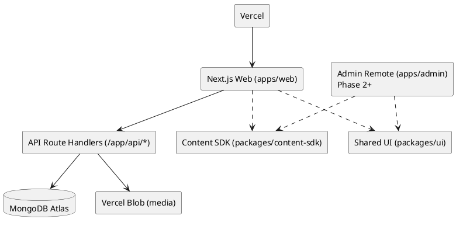

# Architecture

## High-level
- `apps/web` is the SSR host (portfolio + blog + admin route)
- API is implemented via Next Route Handlers under `/app/api/*` (MVP)
- MongoDB Atlas stores content and admin users
- Vercel Blob stores uploaded media; MongoDB stores URLs + metadata

## Component diagram (PlantUML)

## Microfrontend plan
- Phase 1: ship everything inside `apps/web`
- Phase 2: extract Admin as a remote MFE loaded by the host (low SEO risk)
- Phase 3: optionally extract projects/work as a remote

## Non-functional goals
- SEO: SSR pages, clean metadata, sitemap, robots
- A11y: WCAG 2.2 AA
- Security: RBAC + secure cookies + validation + rate limiting
